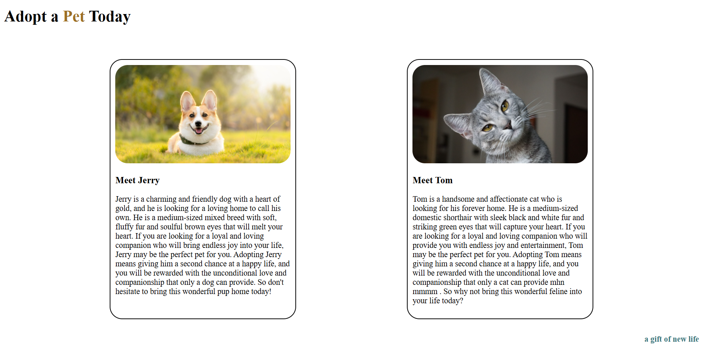
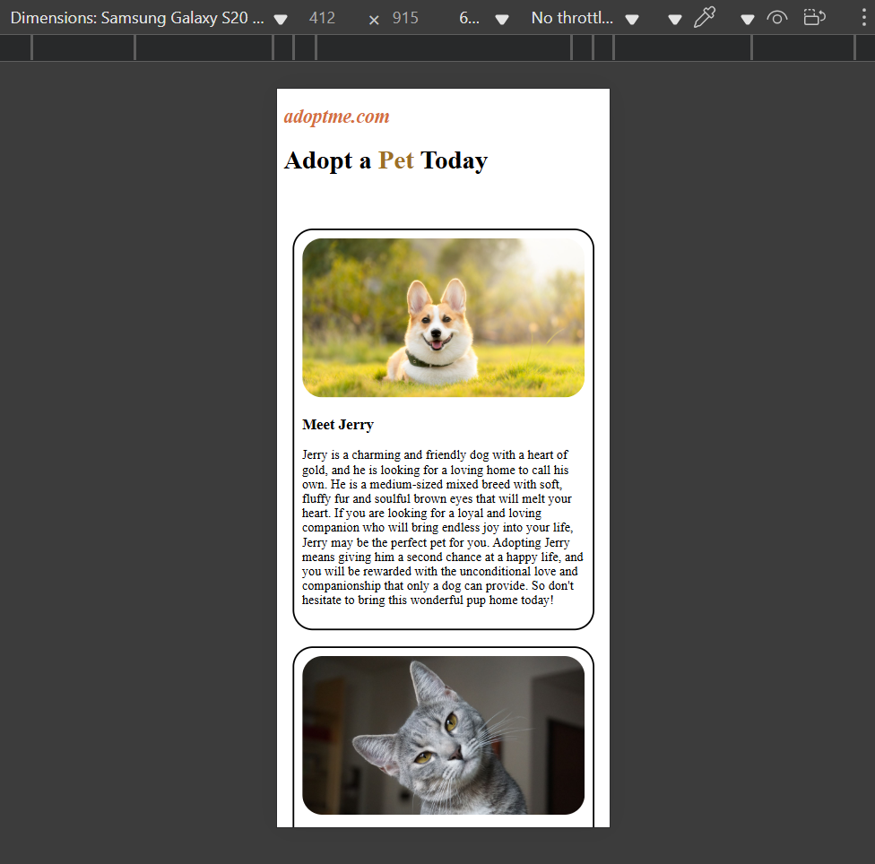

# 🐾 AdoptMe - Pet Adoption Landing Page

This is a simple, responsive pet adoption landing page built using **HTML** and **CSS**. It showcases profiles of pets available for adoption with photos and descriptions, designed to encourage users to adopt a pet.

## 📸 Preview


*A sample pet profile: Jerry the Dog*


*A sample pet Profile: On Mobile View*

## 💡 Features

- Clean and modern layout using Flexbox.
- Responsive design for mobile and smaller screens.
- Profile cards for pets with images and descriptions.
- Simple color scheme to highlight sections.

## 📂 Project Structure

├── index.html # Main HTML file

├── style.css # Stylesheet for the page

└── assets/

├── dog.jpg # Image of Jerry

└── cat.jpg # Image of Tom


## 🔧 How to Use

1. Clone the repository:

   ```bash
   git clone https://github.com/your-username/adoptme-landing-page.git

2. Open index.html in your browser.

3. Customize the content, images, or styles as needed.

📱 Responsive Design
The layout adjusts for screens smaller than 500px using media queries, ensuring a smooth experience on mobile devices.

## 🔗 Live Demo

👉 **[Click here to view the website](https://shaikhimadoddin.github.io/Pet-Adoption-Page/)**


📜 License
This project is open-source and free to use under the MIT License.